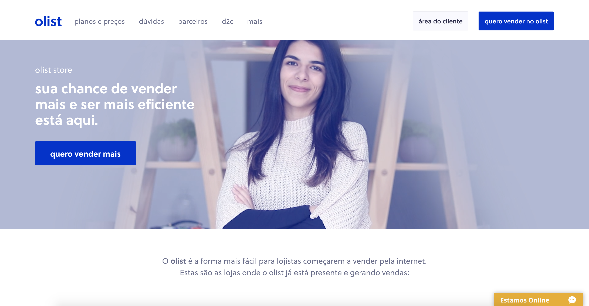

# Olist Analysis

Olist is a leading e-commerce service that connects merchants to main marketplaces in Brazil. They provide a wide range of offers including inventory management, dealing with reviews and customer contacts to logistic services.

This is a Brazilian ecommerce public dataset of orders made at [Olist Store](https://olist.com/).
Olist connects small businesses from all over Brazil to channels without hassle and with a single contract.  
Those merchants are able to sell their products through the Olist Store and ship them directly to the customers using Olist logistics partners.

After a customer purchases the product from Olist Store a seller gets notified to fulfill that order.  
Once the customer receives the product, or the estimated delivery date is due, the customer gets a satisfaction survey by email, where he can give a note for the purchase experience and write down some comments.

## Goal

The goal of my investigation of this dataset was to answer the question:

**How could Olist increase its profit?** 

## Notebooks

All the steps taken during this project are visible in the [notebooks folder](https://github.com/kura-999/olist/tree/main/notebooks). 

Each notebook builds on the previous one and was also used to create the python scripts described later in the README.

## Olist Data

The Olist dataset consists of information (customers, reviews, products etc..) on 100k orders.

9 csvs (~120mb) are available [to downloaded here](https://www.kaggle.com/olistbr/brazilian-ecommerce) and can be found in the [data/csv folder](https://github.com/kura-999/olist/tree/main/data/csv).

### Data Model

The schema below represents each dataset and which key to use to join them:

### Conclusion

Check this [notebook](https://github.com/kura-999/olist/blob/main/notebooks/08_ceo_request.ipynb).
